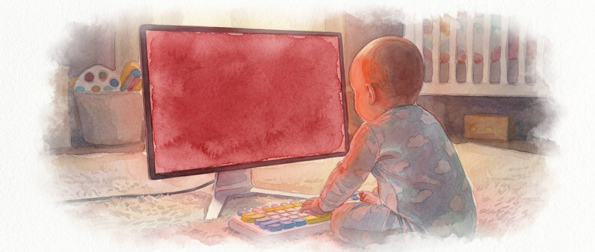

# Baby's First Computer: A Baby Color Game

<div align="center">



## Project Status


"Baby's First Computer" is an early-in-life, foundational game to introduce the youngest humans to interacting with computers and show them they have agency in the world. By cycling colors through keypresses, babies learn their actions create immediate change, transforming their 'first computer' into a lesson in being in control before they can even walk or talk. 

This fullscreen color cycling game is designed for babies (pre-verbal, pre-mobile) with parent supervision. Press any key to cycle through eight vibrant colors with corresponding musical tones.

### [**🚀 Play the Live Demo**](https://slpstream.github.io/babygame/)

</div>

## Table of Contents

- [Quick Start](#quick-start)
- [Color Palette](#color-palette)
- [About](#about)
- [For Parents](forparents.md)
- [Features](#features)
- [Installation](#installation)
- [Usage](#usage)
- [Technical Details](#technical-details)
- [Development](#development)
- [License](#license)
- [Contributing](#contributing)
- [Safety Note](#safety-note)
- [Acknowledgments](#acknowledgments)

## Quick Start

**Python Desktop Version:**
```bash
pip install -e .
babygame
```

**Web Browser Version:**
1. Open [index.html](index.html) in your browser.
2. Click "Start Baby Game" or press any key.

**Direct Run:**
```bash
git clone https://github.com/slpstream/babygame.git
cd babygame && python babygame/babycolor.py
```

## Color Palette

<div align="center">

### **Eight Vibrant Colors**

### **Primary Colors**

🟥 🟩 🟦 🟨 ⬜ ⬛ 💖 🦋

### **Color and Sound Mapping**

| Color | Block | Hex | Note | Frequency |
|-------|-------|-----|------|-----------|
| **Red** | 🟥 | `#FF0000` | C4 | 261 Hz |
| **Green** | 🟩 | `#00FF00` | E4 | 330 Hz |
| **Blue** | 🟦 | `#0000FF` | G4 | 392 Hz |
| **Yellow** | 🟨 | `#FFFF00` | C5 | 523 Hz |
| **White** | ⬜ | `#FFFFFF` | E5 | 659 Hz |
| **Black** | ⬛ | `#000000` | G5 | 784 Hz |
| **Pink** | 💖 | `#FFB6C1` | C6 | 1047 Hz |
| **Cyan** | 🦋 | `#00FFFF` | E6 | 1319 Hz |

</div>

## About

This project provides a baby-friendly interactive experience in two formats:

1. **Python Desktop Version**: A fullscreen PyGame application.
2. **Web Browser Version**: A pure HTML/JavaScript application.

Both versions offer the same core functionality: a fullscreen solid-color display that cycles through eight high-contrast colors with musical tones on any keypress.

## For Parents

For more information on why this program was created and how to set it up for your child, please read [forparents.md](forparents.md).

## History

This is a recreation of Ed Swank's "Baby Game," originally created in 1994. The concept is a simple computer program that allows babies to interact with a computer by pressing keys to change colors.

## Features

- **High-Contrast Colors**: Red, Green, Blue, Yellow, White, Black, Pink, and Cyan.
- **Musical Tones**: Each color corresponds to a musical note (C4 to E6 scale).
- **Fullscreen Mode**: Covers the entire screen to minimize distractions.
- **Simple Controls**: Any key changes the color; ESC exits.
- **Touch Support**: The web version supports touch screens on tablets and phones.
- **No Installation Needed**: The web version runs in any modern browser.
- **Cross-Platform**: Works on Windows, macOS, and Linux.

## Installation

### Python Desktop Version

**Option 1: Clone and Run**
```bash
git clone https://github.com/slpstream/babygame.git
cd babygame
pip install -r requirements.txt
python babygame/babycolor.py
```

**Option 2: Install as Package**
```bash
pip install -e .
babygame
```

### Web Browser Version

1. Open [index.html](index.html) to play the game instantly.
2. Use the "Fullscreen" button or press F11.
3. Press any key or touch the screen to change colors.

### Verify Installation

You can run the test script to verify the installation:

```bash
python test_installation.py
```

The script checks for:
- Python version compatibility
- Required packages (pygame, numpy)
- Main game script availability
- Web files existence

## Usage


### How to Play

1. Start the game (fullscreen activates automatically).
2. The initial screen is solid white.
3. Press any key to cycle through colors: 
   Red → Green → Blue → Yellow → White → Black → Pink → Cyan → Red...
4. Press ESC to exit.

Each color change plays a corresponding musical tone.


## Technical Details

### Python Version
- **Framework**: PyGame and NumPy.
- **Display**: Fullscreen at native resolution.
- **Audio**: Programmatically generated tones with fade-out envelopes.
- **Dependencies**: `pygame>=2.0.0`, `numpy>=1.20.0`.

### Web Version
- **Technology**: Pure HTML/CSS/JavaScript with no external dependencies.
- **Audio**: Web Audio API for real-time sound generation.
- **Input**: Supports keyboard, mouse, and touch events.

## Development

See [CONTRIBUTING.md](CONTRIBUTING.md) for development guidelines.

- **babygame/**: Core Python package.
  - `babycolor.py`: Main game logic.
  - `__init__.py`: Package initialization.
- **assets/**: Project assets and documentation images.
- **index.html**: Web-based implementation (Live Demo).
- **PYTHON-SPEC.md**: Technical specification for the Python version.
- **WEB-SPEC.md**: Technical specification for the web version.
- **LICENSE**: MIT License.
- **README.md**: Project overview and documentation.
- **CHANGELOG.md**: History of project changes.
- **CONTRIBUTING.md**: Guidelines for development.
- **forparents.md**: Background and setup tips for parents.
- **setup.py** / **pyproject.toml**: Python packaging configuration.
- **.gitignore**: Git exclusion rules.

## License

MIT License - see the [LICENSE](LICENSE) file for details.

## Contributing

Contributions are welcome. Please read [CONTRIBUTING.md](CONTRIBUTING.md) for development guidelines.

**Ways to contribute:**
- Report bugs
- Suggest features 
- Submit pull requests
- Improve documentation

## Safety Note


### Parental Supervision Required

This software is designed for babies under **active parental supervision**. Always supervise children when they are using computers or electronic devices.

